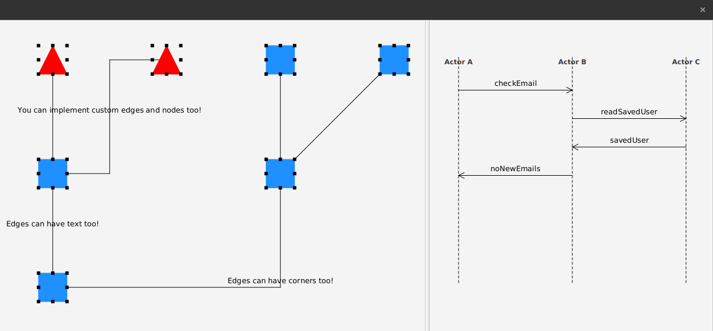

# FXGraph

FXGraph is javafx graph visualizer. It's a continuation of a post I found on stackoverflow. Pull requests and feature requests are appreciated.
You can find the original question here: https://stackoverflow.com/questions/30679025/graph-visualisation-like-yfiles-in-javafx

## Features
 - Draggable nodes
 - Resizable nodes
 - Zooming / Panning
 - Custom nodes and edges
 - Random layout
 - Tree layout

## Screenshot


## Download
You can get it from maven central
```xml
<dependency>
	<groupId>com.sirolf2009</groupId>
	<artifactId>fxgraph</artifactId>
	<version>0.0.3</version>
</dependency>
``` 

## Usage
You can look at ```com.fxgraph.graph.MainApp``` for a basic example. The relevant code for the graph in the screenshot above is as follows
```java
Graph graph = new Graph();
final Model model = graph.getModel();

graph.beginUpdate();

final ICell cellA = new RectangleCell();
final ICell cellB = new RectangleCell();
final ICell cellC = new RectangleCell();
final ICell cellD = new TriangleCell();
final ICell cellE = new TriangleCell();
final ICell cellF = new RectangleCell();
final ICell cellG = new RectangleCell();

model.addCell(cellA);
model.addCell(cellB);
model.addCell(cellC);
model.addCell(cellD);
model.addCell(cellE);
model.addCell(cellF);
model.addCell(cellG);

final Edge edgeAB = new Edge(cellA, cellB);
edgeAB.textProperty().set("Edges can have text too!");
model.addEdge(edgeAB);
final CorneredEdge edgeAC = new CorneredEdge(cellA, cellC, Orientation.HORIZONTAL);
edgeAC.textProperty().set("Edges can have corners too!");
model.addEdge(edgeAC);
model.addEdge(cellB, cellD);
final DoubleCorneredEdge edgeBE = new DoubleCorneredEdge(cellB, cellE, Orientation.HORIZONTAL);
edgeBE.textProperty().set("You can implement custom edges and nodes too!");
model.addEdge(edgeBE);
model.addEdge(cellC, cellF);
model.addEdge(cellC, cellG);

graph.endUpdate();

graph.layout(new RandomLayout());
``` 
Or for the sequence diagram
```java
SequenceDiagram seqDiagram = new SequenceDiagram();

ActorCell actorA = new ActorCell("Actor A", 400d);
ActorCell actorB = new ActorCell("Actor B", 400d);
ActorCell actorC = new ActorCell("Actor C", 400d);
Arrays.asList(actorA, actorB, actorC).forEach(actor -> seqDiagram.addActor(actor));

seqDiagram.addMessage(actorA, actorB, "checkEmail");
seqDiagram.addMessage(actorB, actorC, "readSavedUser");
seqDiagram.addMessage(actorC, actorB, "savedUser");
seqDiagram.addMessage(actorB, actorA, "noNewEmails");

seqDiagram.layout();
```

## TODO
If you have a feature request, just file an issue.
 - unit tests
 - better layouts